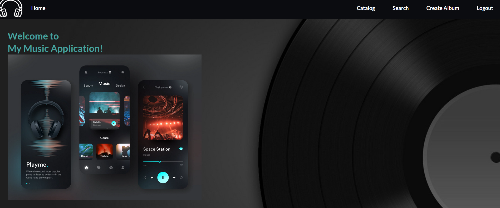
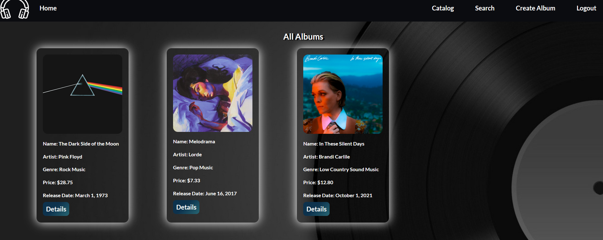
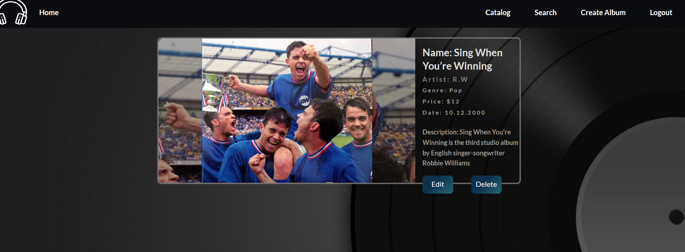
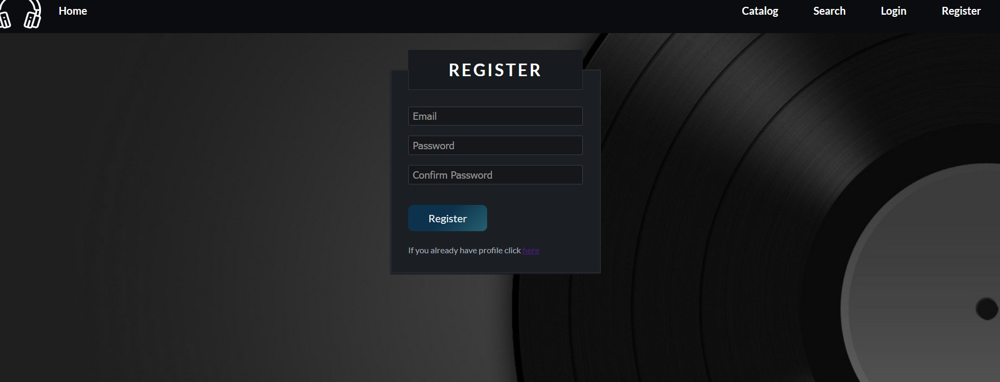

<h1>Music App</h1>
<h2>Single Page Application created with Vanilla JS</h2>

<h3>Usage:</h3>

To start the server

cd server

node server.js

To start the frontend

npm start

To start the tests:

cd tests

npm run test

